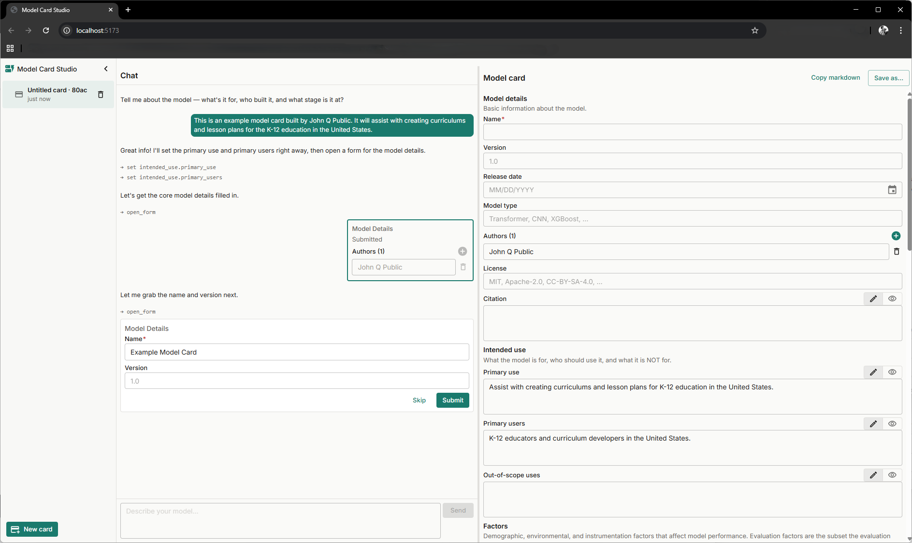

- **Role:** Solo developer — architecture, design, implementation.
- **Timeline:** ~6 weeks to current state; ongoing.
- **Context:** Personal/founder project, built alongside a full-time role and another in-development personal application of comparable scope.
- **Scope:** Two npm packages (`core`, `ui-kit`); two consuming apps in active development.

`@alster-built/frontend` started with one requirement: an AI assistant should be able to drop a real, validated form right into a conversation. Mid-flow. The assistant figures out what to ask; the form appears inline with those fields; the user fills it; the result flows back. Useful for plenty of other things, but that was the seed.

For that to work, the form structure has to be data, not code. JSX-at-compile-time forms can't show up at runtime with whatever fields the assistant just decided to ask about. So the foundation is a runtime-schema-driven form system. Everything else followed from solving that one problem.

Two audiences came along for the ride.

- **End users**: low visual noise, efficient task completion. If there are only four options, hiding them in a dropdown is two clicks for a user. Can we make one possible? Can it do that automatically?
- **Developers**: a developer shouldn't have to fight with CSS and extra divs just to get a particular area of the page to scroll. Solve those things at the toolkit level. Once. Then every application built on top benefits without re-solving them on every page of every app. Forms can be described declaratively, not wired by hand. A delete button can indicate its intent as `destructive`, instead of thinking about colors.

The toolkit ships two packages — `core` for contract types and validation, `ui-kit` for the React/MUI rendering — and rests on two decisions: a form system that renders from runtime schemas, and semantic components opinionated enough to make context-appropriate choices on their own.


_Model Card Studio — the assistant calls `open_form` mid-conversation with a slice of the schema; the inline form in the chat and the side panel render from the same `FieldDefinition` array. (Later renamed Form Filler Studio when the schema-pack refactor landed — see [T2](/blog/t2-schema-pack-architecture).)_

## Forms at runtime, not compile time

Most approaches to forms in React assume the form structure is known when you write the code — the form is JSX.

This toolkit takes a different approach: the form structure is data. A form is an array of `FieldDefinition` objects — or, when you need labeled sections, an array of sections holding its fields. `FormRenderer` takes that array as `items`, the current values, and an `onChange`, and produces the UI:

```tsx
const sections: SectionDefinition[] = [
  {
    id: "main",
    label: "Annotation",
    fields: [
      { id: "title", type: "text", label: "Title", required: true },
      {
        id: "severity",
        type: "select",
        label: "Severity",
        selectConfig: {
          options: [
            { value: "mild", label: "Mild" },
            { value: "moderate", label: "Moderate" },
            { value: "severe", label: "Severe" },
          ],
        },
      },
    ],
  },
];

<FormRenderer
  items={sections}
  values={values}
  onChange={(fieldId, value) => setValues((v) => ({ ...v, [fieldId]: value }))}
/>;
```

The renderer holds no state — values, submission, and routing stay with the app. And because `FieldDefinition` is defined in `core` (zero React), the same schema can feed the Zod validator. That validator can run anywhere — a Node backend, a build script, a CLI — with no duplication and no drift between client and server types.

The chat app proves it end-to-end: `open_form(field_ids, initial_values)` is an assistant tool call, and the inline form it produces in the chat message is a `FormRenderer` instance over a slice of the same schema the side panel uses to display the full document. One schema, two mount points, the same validator on every write.

The same approach supports more than chat. A CMS where editors define content types at runtime. A domain-knowledge tool where the shape of an annotation depends on which domain is loaded. Anywhere the form structure is part of the application's _content_ rather than its code, hardcoded forms cut you off.

Eleven built-in field types cover the common ground: text, select, multi-select, number, numeric intervals, date, boolean, color, compound, list, variant. Four composition patterns extend them:

- **Tagged unions** — `variant` field; switching a discriminator swaps the visible sub-fields.
- **Cascading options** — `options: (values) => ...` on the field; sees the form's other values.
- **Shared / live option sources** — `() => ...` on `FieldRendererProvider.optionSets`, referenced by name; sees no form values by design. For store state, fetched lists, or anything multiple fields read from one place.
- **Custom controls** — `customFields` on the renderer; domain-specific inputs referenced by type name in the schema.

Every form still renders through `FormRenderer`.

## Semantic over configurable

Most component libraries give you parts. You decide which variant, which color, which spacing, on every page, and subtle inconsistencies creep in each time.

This toolkit takes a different position: components should know their context and make the right call on their own. The developer declares intent; the component handles execution.

**Behavior adapts.** A select with three options doesn't need a dropdown. The user should see the options and click one — no hidden state, no second click. The toolkit's Select field knows this: 2-5 options render as an inline toggle group; 6-19 render as a dropdown; 20 or more render as a searchable autocomplete. All three cases share one `FieldDefinition`; the display is the toolkit's call.

**Styling resolves inward.** The `Button` takes two semantic props. `variant` sets emphasis: `primary`, `secondary`, `tertiary`. `intent` sets meaning: `normal`, `destructive`, `neutral`. A destructive secondary button is `<Button variant="secondary" intent="destructive" />`. The kit resolves those to the right MUI variant and color internally. No `sx`, no spacing props, no MUI passthroughs; spacing comes from the parent layout.

The same pattern runs through the rest of the kit:

- `Drawer` with a `footer` slot so primary actions stay visible when the body scrolls
- `ConfirmButton`, which wraps a destructive action in a confirmation dialog — `<ConfirmButton onConfirmed={remove} />` instead of hand-wiring the button, dialog title and message, two buttons, and the dialog's open/close state
- `NotificationsProvider` with a four-severity toast API

Each one surfaces a semantic API and handles the fiddly MUI wiring internally, so app code can be focused on the features, not the plumbing.

MUI is still the foundation. Apps reach for `Box`, `Stack`, `Typography`, layout containers, and `@mui/icons-material` directly — those aren't semantic components, and the toolkit doesn't try to wrap them. The code smell is narrower: importing `@mui/material/Button` when the semantic `Button` exists, or raw `TextField`, `Autocomplete`, or `Select` when the toolkit already wraps them. The semantic components exist so developers don't relitigate "what color does a destructive action use here?" on every button in every app.

The trade-off: apps lose options. A one-off design that doesn't fit the semantic API requires either extending the component or doing without — and the conventions only pay off if you actually follow them, even when you're the only one using them. In exchange, apps are easier to build, easier to keep consistent, and easier to upgrade. A breaking MUI change touches one place, not every consuming app.

## What this isn't

- **Not a form state manager.** The renderer is stateless — `(definition, value, onChange)` in, UI out. Apps bring the state layer they want.
- **Not a design system generator.** One opinionated theme, a curated component set. If you need six themes and a theme editor, look elsewhere.
- **Not a router or data layer.** TanStack Router, TanStack Query, Redux, whatever — the toolkit has no opinion. Wire them up at the app level.

## Where it stands

The toolkit serves two consumers. The chat-driven form-filler is its founding use case — rich, validated forms rendered inline in a conversation, with the assistant deciding mid-flight what to ask — and was the exercise that proved the pattern end-to-end. A separate app in a different domain runs on the same toolkit and stress-tests the `customFields` and `variant` escape hatches against controls no built-in field can model. Two unrelated apps closed the early big gaps in the form system and the component set.

Next: the chat-driven form-filler was generalized into a schema-pack architecture, so adding a new document type is a JSON file rather than a new app. [T2 covers that refactor](/blog/t2-schema-pack-architecture).
