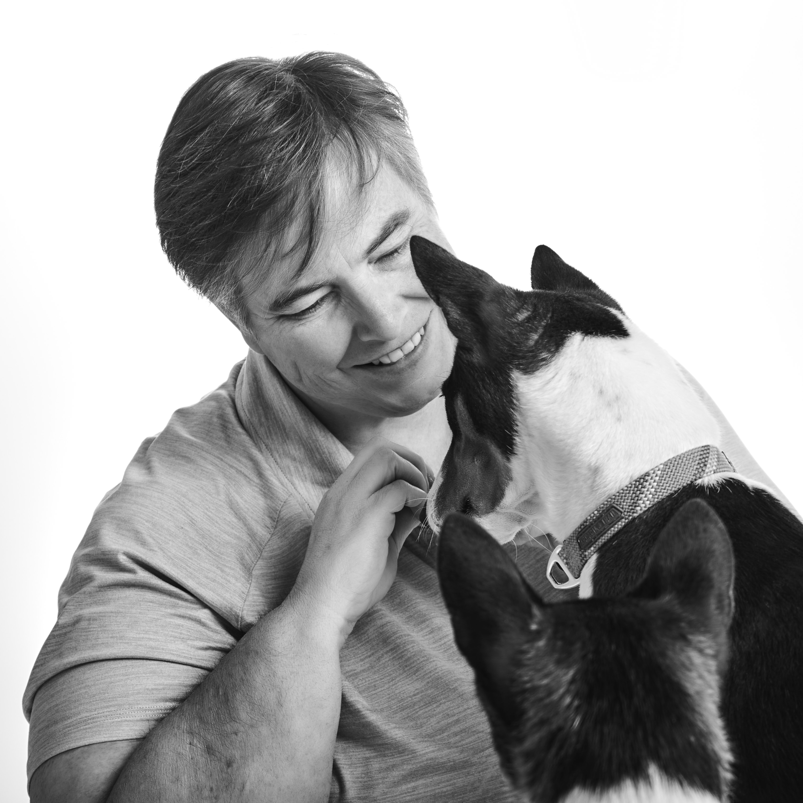

Frontend engineer and UX architect.

Greenfield builds. Complex problem spaces. Design systems, component architectures, and the words on the screen.

People know what they need to get done. My job is making the software stay out of their way.

## Personal

[Alster-Built](https://github.com/Alster-Built) is where my personal projects live. Currently a platform for reasoning under uncertainty and a frontend toolkit for runtime-schema-driven form interfaces.

Two [basenjis](/alster-basenjis/), retired show dogs - now my nosework partners. Active in dog sports and clubs. Geodetic benchmark hunting, a nod to my dad.

Abhors clutter, yet surrounded by it. Aspiring minimalist. Plotting extended road trips.

Based south of Seattle.

---

[Resume](/resume/) · [Blog](/blog/)
